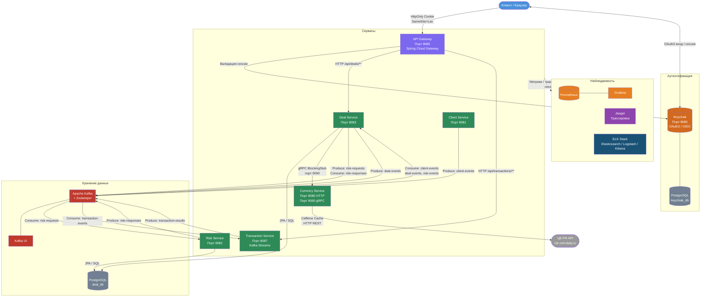
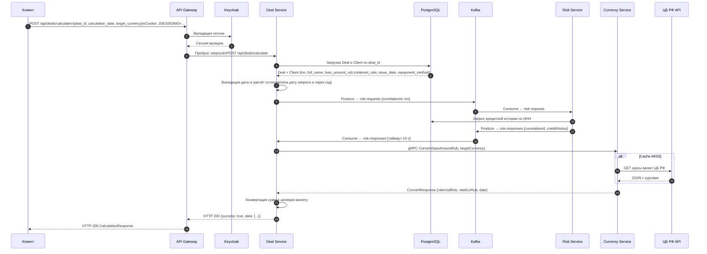
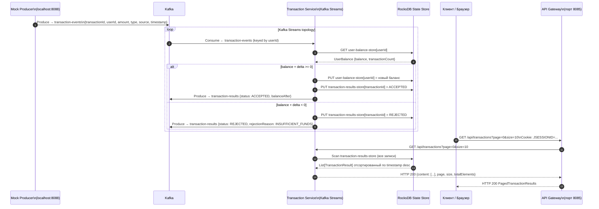

# Архитектура

## Диаграмма компонентов

```mermaid
graph TD
    Client([Клиент / Браузер])
    CBR([ЦБ РФ API\ncbr-xml-daily.ru])

    subgraph Аутентификация
        Keycloak[(Keycloak\nПорт 8080\nOAuth2 / OIDC)]
        DBKeycloak[(PostgreSQL\nkeycloak_db)]
        Keycloak --- DBKeycloak
    end

    subgraph services[Сервисы]
        Gateway[API Gateway\nПорт 8085\nSpring Cloud Gateway]
        DealSvc[Deal Service\nПорт 8083]
        RiskSvc[Risk Service\nПорт 8082]
        CurrencySvc[Currency Service\nПорт 8080 HTTP\nПорт 9090 gRPC]
        ClientSvc[Client Service\nПорт 8081]
        TransactionSvc[Transaction Service\nПорт 8087\nKafka Streams]
    end

    subgraph Хранение данных
        DB[(PostgreSQL\ndeal_db)]
        Kafka[[Apache Kafka\n+ Zookeeper]]
        KafkaUI[Kafka UI]
        Kafka --- KafkaUI
    end

    subgraph observability[Наблюдаемость]
        Prometheus[(Prometheus)]
        Grafana[Grafana]
        Jaeger[Jaeger\nТрассировка]
        ELK[ELK Stack\nElasticsearch / Logstash / Kibana]
        Prometheus --- Grafana
    end

    Client -->|HttpOnly Cookie\nSameSite=Lax| Gateway
    Client <-->|OAuth2 вход / сессия| Keycloak
    Gateway -->|Валидация сессии| Keycloak
    Gateway -->|HTTP /api/deals/**| DealSvc
    Gateway -->|HTTP /api/transactions/**| TransactionSvc

    DealSvc -->|JPA / SQL| DB
    RiskSvc -->|JPA / SQL| DB

    DealSvc -->|gRPC BlockingStub\nпорт 9090| CurrencySvc
    CurrencySvc -->|Caffeine Cache\nHTTP REST| CBR

    DealSvc -->|Produce: risk-requests\nConsume: risk-responses| Kafka
    Kafka -->|Consume: risk-requests| RiskSvc
    RiskSvc -->|Produce: risk-responses| Kafka

    DealSvc -->|Produce: deal-events| Kafka
    ClientSvc -->|Produce: client-events| Kafka
    Kafka -->|Consume: client-events\ndeal-events, risk-events| DealSvc

    Kafka -->|Consume: transaction-events| TransactionSvc
    TransactionSvc -->|Produce: transaction-results| Kafka

    services -->|Метрики / трассировка / логи| observability

    style Client fill:#4A90D9,color:#fff
    style CBR fill:#999,color:#fff
    style Gateway fill:#7B68EE,color:#fff
    style DealSvc fill:#2E8B57,color:#fff
    style RiskSvc fill:#2E8B57,color:#fff
    style CurrencySvc fill:#2E8B57,color:#fff
    style ClientSvc fill:#2E8B57,color:#fff
    style TransactionSvc fill:#2E8B57,color:#fff
    style Keycloak fill:#D2691E,color:#fff
    style DB fill:#708090,color:#fff
    style DBKeycloak fill:#708090,color:#fff
    style Kafka fill:#C0392B,color:#fff
    style KafkaUI fill:#C0392B,color:#fff
    style Prometheus fill:#E67E22,color:#fff
    style Grafana fill:#E67E22,color:#fff
    style Jaeger fill:#8E44AD,color:#fff
    style ELK fill:#1A5276,color:#fff
```

## Sequence-диаграмма — `POST /api/deals/calculate`

```mermaid
sequenceDiagram
    autonumber
    participant C as Клиент
    participant GW as API Gateway
    participant KC as Keycloak
    participant DS as Deal Service
    participant DB as PostgreSQL
    participant K as Kafka
    participant RS as Risk Service
    participant CS as Currency Service
    participant CBR as ЦБ РФ API

    C->>GW: POST /api/deals/calculate\n{deal_id, calculation_date, target_currency}\nCookie: JSESSIONID=...

    GW->>KC: Валидация сессии
    KC-->>GW: Сессия валидна

    GW->>DS: Проброс запроса\nPOST /api/deals/calculate

    DS->>DB: Загрузка Deal и Client по deal_id
    DB-->>DS: Deal + Client (inn, full_name, loan_amount_rub,\ninterest_rate, issue_date, repayment_method)

    DS->>DS: Валидация даты и расчёт остатков\n(на дату запроса и через год)

    DS->>K: Produce → risk-requests {correlationId, inn}
    K->>RS: Consume ← risk-requests
    RS->>DB: Запрос кредитной истории по ИНН
    RS->>K: Produce → risk-responses {correlationId, creditHistory}
    K->>DS: Consume ← risk-responses [таймаут 10 с]

    DS->>CS: gRPC Convert(loanAmountRub, targetCurrency)

    alt Cache MISS
        CS->>CBR: GET курсы валют ЦБ РФ
        CBR-->>CS: JSON с курсами
    end
    CS-->>DS: ConvertResponse {rateUsdRub, rateEurRub, date}

    DS->>DS: Конвертация сумм в целевую валюту

    DS-->>GW: HTTP 200 {success: true, data: {...}}
    GW-->>C: HTTP 200 CalculationResponse
```

## Sequence-диаграмма — `GET /api/transactions` (Kafka Streams)

```mermaid
sequenceDiagram
    autonumber
    participant MP as Mock Producer\n(localhost:8088)
    participant K as Kafka
    participant TS as Transaction Service\n(Kafka Streams)
    participant RS as RocksDB State Store
    participant C as Клиент / Браузер
    participant GW as API Gateway\n(порт 8085)

    MP->>K: Produce → transaction-events\n{transactionId, userId, amount, type, source, timestamp}

    loop Kafka Streams topology
        K->>TS: Consume ← transaction-events (keyed by userId)
        TS->>RS: GET user-balance-store[userId]
        RS-->>TS: UserBalance {balance, transactionCount}

        alt balance + delta >= 0
            TS->>RS: PUT user-balance-store[userId] = новый баланс
            TS->>RS: PUT transaction-results-store[transactionId] = ACCEPTED
            TS->>K: Produce → transaction-results {status: ACCEPTED, balanceAfter}
        else balance + delta < 0
            TS->>RS: PUT transaction-results-store[transactionId] = REJECTED
            TS->>K: Produce → transaction-results {status: REJECTED, rejectionReason: INSUFFICIENT_FUNDS}
        end
    end

    C->>GW: GET /api/transactions?page=0&size=10\nCookie: JSESSIONID=...
    GW->>TS: GET /api/transactions?page=0&size=10
    TS->>RS: Scan transaction-results-store (все записи)
    RS-->>TS: List[TransactionResult] отсортированный по timestamp desc
    TS-->>GW: HTTP 200 {content: [...], page, size, totalElements}
    GW-->>C: HTTP 200 PagedTransactionResults
```
